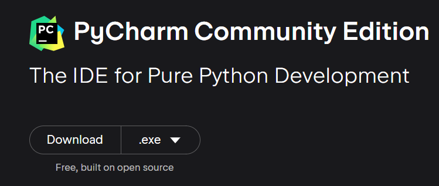

# python学习笔记

https://www.bilibili.com/video/BV1qW4y1a7fU?p=102&vd_source=2384206e0cca974945c9ce5d1cb7fbd0

## 1.下载安装

### 1.1 python下载安装
网址 => https://python.org 安装exe时候注意点选path配置项
cmd下运行python代码 
```
python test.py
```

### 1.2 pycharm下载安装

网址 => https://www.jetbrains.com/  下载使用community version是免费的
 


### 1.3 pycharm新建项目时选好解释器


## 2.python基础

### 2.1 python注释

多行注释 """"""
单行注释 #

### 2.2 python变量类型

int, float, str, list[], tuple(), set{}, dict{"key":value}

type函数可以显示变量类型

### 2.3 python标识符

类名首字母大写

### 2.4 python字符串

* 转义字符用\   
前面加r转义不可用, 如 r'\d'

* 拼接用+   

* 格式化

"%占位符" % 变量   如%5d, %5.2f

或用 f"{变量}{变量}"快速格式化,没有精度控制

### 2.5 python条件语句,循环语句

用tab控制层级
if 条件:
    语句
elseif 条件:
    语句
else: 
    语句

while 条件:
    语句

for x in range(起始值,终止值,步长)   或者 for x in 序列等,如list/tuple

### 2.6 python函数

def 函数名(参数):
    函数体
    return 返回值1,返回值2,返回值3

x,y,z = fn()

函数参数,类型注解可以不写
```
from typing import Union

def userinfo(name: str, age: int, gender: str = '男') -> Union[int, str]:
    print(f'名字是{name},年龄是{age},性别是{gender}')
    return name, age

userinfo('小红', age=19)


:和->是类型注解,:是参数的类型,->是返回值的类型, Union需要倒入, 可以表示类型组合

# 不定长参数 - 元组
def userinfo(*args):    
    print(f'args的参数类型是{type(args)},内容是{args}')
userinfo('小红',age=19,'男')

#不定长参数 - 字典
def userinfo(*kwargs):    
    print(f'kwargs的参数类型是{type(kwargs)},内容是{kwargs}')
userinfo(name='小红',age=19,gender='男')
```

函数也可以当作函数的参数或返回值

匿名函数 lambda 参数:单句函数体

None 用于函数返回或者变量定义,意思是无意义的.

### 2.7 python数据容器

append()添加新元素, len()长度,index()返回数据下标, count()返回出现次数
切片[起始:终止:步长]  算头不算尾,步长可以省略


### 2.8 python文件操作

* 读文件
```
f = open('C:/Users/210462672/Desktop/book.txt', 'r', encoding='UTF-8')
print(type(f))
print(type(f.readline()))
print(type(f.readlines()))
print(type(f.read()))
for line in f:
    print({line})
    print(type(line))
f.close()
```
result
<class '_io.TextIOWrapper'>
<class 'str'>
<class 'list'>
<class 'str'>

* 写文件

```
f = open('C:/Users/210462672/Desktop/book.txt', 'w', encoding='UTF-8')
f.write(msg)
f.flush()  #内存中积累的写操作,写入硬盘
f.close()   
```

* 追加写文件

```
f = open('C:/Users/210462672/Desktop/book.txt', 'a', encoding='UTF-8')
f.write(msg)
f.flush()  #内存中积累的写操作,写入硬盘
f.close()   
```

### 2.9 python异常操作

```
try:
    f = open('C:/Users/210462672/Desktop/book.txt', 'r', encoding='UTF-8')
except:
    print("出现异常了")
    f = open('C:/Users/210462672/Desktop/book.txt', 'w', encoding='UTF-8')
else:
    print("没有异常时执行的代码")
finally:
    print("最终都会执行的代码")
    f.close()
```

### 2.10 python模块

import 模块名 使用时要模块名.模块

or

from 模块名 import 模块 使用时直接用模块

建python package建包,然后把模块放里面,里面必有__init__.py文件,这是与dictionary的区别

pip install [-i 包镜像地址] 包名 #安装第三方包

### 2.11 json

```
import json

data = [{"name":"jeff","age":16},{"name":"terry","age":18}]
data = json.dumps(data)   # python数据转json
data = json.loads(data)   # json转phthon数据

```

## 3.Echarts可视化图表

pip install pyecharts

官方画廊 => https://gallery.pyecharts.org/#/README


## 4.python面向对象

### 4.1 构造方法

成员可以不定义直接在构造方法里赋值产生


### 4.2 魔术方法

__str__一般是给print用的

__lt__是与比较运算符或sort连用


### 4.3 继承

```
class MyPhone(Phone, NFCReader, RemoteControl):
    pass
```
子类继承父类同名属性时左边的优先

super().父类成员
super().父类成员方法()

### 4.4 多态

抽象类, 父类用pass设空做设计，不同子类具体实现不同功能

```
class AC:
    def cool_wind(self):
        pass

    def hot_wind(self):
        pass


class MideaAC(AC):
    def cool_wind(self):
        print('美的空调制冷')

    def hot_wind(self):
        print('美的空调制冷')


class GreeAC(AC):
    def cool_wind(self):
        print('格力空调制冷')

    def hot_wind(self):
        print('格力空调制冷')

def make_cool(ac: AC):
    print('还要写其他很多代码，所以不直接调用cool_wind，而用了函数调用父类对象参数')
    ac.cool_wind()

midea_ac = MideaAC()
gree_ac = GreeAC()

make_cool(midea_ac)
make_cool(gree_ac)
```

### 4.5 闭包
双层函数，内层函数调用外层函数的变量。将内层函数作为外层函数的返回值，此内层函数就是闭包函数。
临时变量函数调用之后就消失，全局变量谁都能改，包括import的都能改，太不安全。
用闭包函数实现对外层函数变量的修改，由于
修改的外层函数变量要在闭包里用nonlocal关键字声明
```
def account_create(initial_amount=0):
    def atm(num, deposit=True):
        nonlocal initial_amount
        if deposit:
            initial_amount += num
            print(f'存款：+{num},余额：{initial_amount}')
        else:
            initial_amount -= num
            print(f'存款：-{num},余额：{initial_amount}')

    return atm


atm1 = account_create()
atm1(300)
atm1(200, deposit=False)
atm1(100)
```

### 4.6 装饰器
装饰器也是一种闭包，不改动原有函数时，给原有函数加新功能

```
def outer(func):
    def inner():
        print('我要睡觉了')
        func()
        print('我要起床了')

    return inner


@outer
def sleep():
    import random
    import time
    print('睡眠中。。。')
    time.sleep(random.randint(1, 5))


sleep()
```
@outer实际上是
```
fn = outer(sleep)
fn()
```

### 4.7 多线程编程
target后面跟着线程跑的函数，args参数是线程跑函数的元组参数，kwargs是线程跑函数的字典参数，顺序必须一致。
```
import time
import threading


def sing(msg):
    while True:
        print(msg)
        time.sleep(1)


def dance(msg):
    while True:
        print(msg)
        time.sleep(1)


sing_thread = threading.Thread(target=sing, args=('我在唱歌，哈哈哈',))  # 单个参数的元组注意后面要有逗号
dance_thread = threading.Thread(target=dance, kwargs={"msg": '我在跳舞，哈哈哈'})

sing_thread.start()
dance_thread.start()

```

